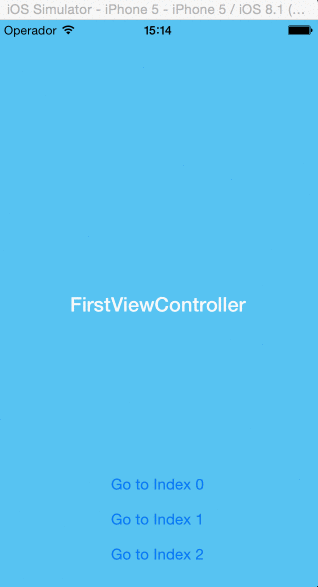
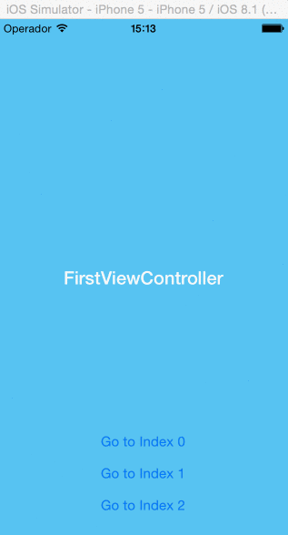

# ISScrollViewPageSwift

Easy scrollView page viewer implementation written in Swift.

<p align="center">
  
  
</p>

## Current Version

Version: 1.0.0

## How to install it?

[CocoaPods](http://cocoapods.org) is the easiest way to install ISScrollViewPageSwift. Run ```pod search ISScrollViewPageSwift``` to search for the latest version. Then, copy and paste the ```pod``` line to your ```Podfile```. Your podfile should look like:

```c
platform :ios, '8.0'
pod 'ISScrollViewPageSwift'
```

Finally, install it by running ```pod install```.

If you don't use CocoaPods, only import ```ISScrollViewPage.swift``` to your project.

## How to use it?

Firts of all, you need to know:

- You don't need to create a NIB file to use ISScrollViewPageSwift.
- You need to choose the orientation of ISScrollViewPageSwift (Horizontally or Vertically)

### NIB implementation

Only override viewDidLoad() func:

```swift
class MainViewController: UIViewController , ISScrollViewPageDelegate{
        
        @IBOutlet weak var scrollViewPage:ISScrollViewPage!

        override func viewDidLoad() {
                super.viewDidLoad()
                self.scrollViewPage.scrollViewPageDelegate = self;
                self.scrollViewPage.scrollViewPageType = ISScrollViewPageType.vertically
                self.scrollViewPage.setViewControllers(controllers)
                // or self.scrollViewPage.setCustomViews()
        }
}
```

### No NIB implementation

Only override loadView() func and set self.view:

```swift
override func loadView() {
        self.scrollViewPage = ISScrollViewPage(frame: UIScreen.mainScreen().applicationFrame)
        self.scrollViewPage!.scrollViewPageType = ISScrollViewPageType.vertically
        self.scrollViewPage!.setViewControllers(controllers)
        self.view = self.scrollViewPage
}
```
### Customization

```
scrollViewPageType (ISScrollViewPageType.vertically or ISScrollViewPageType.horizontally)
setEnableBounces (true or false)
setPaging (true or false)
```

## Requirements

* iOS 8.0+
* Xcode 8.0

## TODO
- [ ] Add Padding between views/view controllers

## Contact

If you have any questions comments or suggestions, send me a message. If you find a bug, or want to submit a pull request, let me know.

* daniel@ilhasoft.com.br
* https://twitter.com/danielamarall

## Copyright and license

Copyright (c) 2015 Daniel Amaral (https://twitter.com/danielamarall). Code released under [the MIT license](LICENSE).
